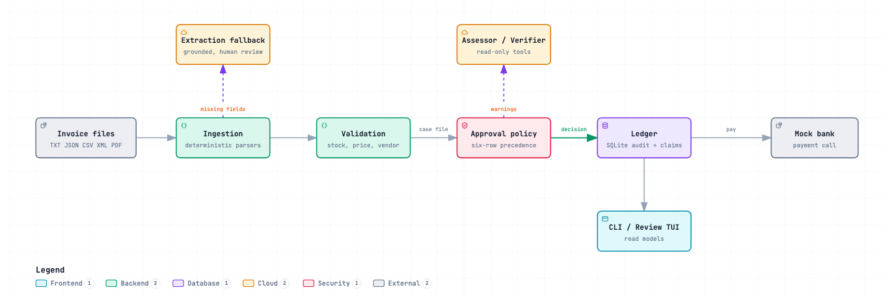
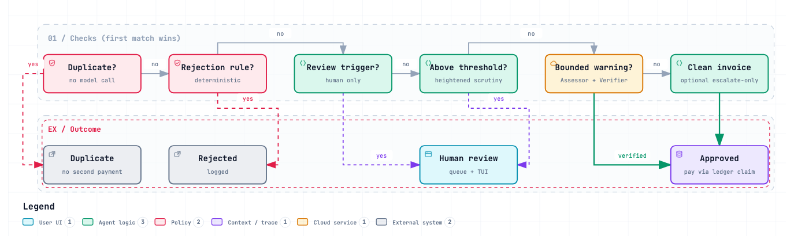

# Invoice Flow — Solution Guide

This repository contains a local-first invoice processing prototype that combines deterministic
financial controls with bounded LLM assistance. This document explains the implemented solution and
the fastest review path.

## Five-minute review

### 1. Install

Requirements: Python 3.12+ and [uv](https://docs.astral.sh/uv/) on macOS, Linux, or Windows.

```bash
uv sync --all-extras --locked
```

`uv.lock` pins the complete environment. The `tui` extra is optional at runtime, but included by
the command above for the full review experience.

### 2. Configure Grok

The full solution runs with the Grok tier: the model roles described in [Agentic path](#agentic-path)
review every decision, extract missing fields, and investigate warnings. Configuration is read from
the process environment; local env files are intentionally not loaded automatically. Set the
variables in the same shell that runs the commands.

macOS / Linux (bash, zsh):

```bash
export XAI_API_KEY="..."
export GROK_BASE_URL="https://<provider-base>/v1"
export XAI_MODEL="grok-4.7"  # optional; this is the default
```

Windows (PowerShell):

```powershell
$env:XAI_API_KEY = "..."
$env:GROK_BASE_URL = "https://<provider-base>/v1"
$env:XAI_MODEL = "grok-4.7"  # optional; this is the default
```

### 3. Run the complete sample corpus with Grok

```bash
uv run python main.py --invoice_path=data/invoices --llm=grok --ledger=demo-ledger.db --inventory=demo-inventory.db
```

The commands in this guide are single-line and shell-neutral: they run unchanged in bash, zsh,
PowerShell, and `cmd`. The demo databases are created in the current directory (`*.db` is
git-ignored); delete `demo-*.db` to start fresh. The inventory database is seeded automatically
when the requested path does not exist.

Files are processed four at a time, because model round trips dominate each file's time. Set
`INVOICE_WORKERS` to change that (`INVOICE_WORKERS=1` processes one file at a time; try `2` if the
provider rate-limits you). Invoices that share an identity always run in file order, so a revision
never overtakes its original. If online configuration is incomplete, startup fails explicitly
instead of silently switching tiers.

### 4. Inspect the review queue

```bash
uv run python main.py review --list --ledger=demo-ledger.db
```

### 5. Open the reviewer TUI

```bash
uv run python main.py tui --ledger=demo-ledger.db --inventory=demo-inventory.db --llm=grok
```

The TUI cold-starts: a missing ledger or inventory database is created on startup (the
inventory is seeded automatically), and it opens on the new-run view. Press `enter` on the
default `data/invoices/` source to run the batch from inside the TUI with the same `--llm`
tier, or run step 3 first and the TUI will browse that ledger instead.

A run shows live progress per file, what each file parsed into (vendor, number, total,
findings) in the ingestion pane, and the agent log.

### Optional: the offline baseline

Offline mode performs no model or external network calls, so it needs no keys. It is the
deterministic rules-only baseline: useful to see what the rules alone decide, and to compare with
the Grok run. Use separate database files so the two runs do not mix:

```bash
uv run python main.py --invoice_path=data/invoices --llm=offline --ledger=offline-ledger.db --inventory=offline-inventory.db
```

A fresh offline run currently finishes with:

```text
paid: 6, needs_review: 8, logged_rejection: 4, duplicate: 2; failed: 0
```

Browse it with `uv run python main.py tui --ledger=offline-ledger.db --inventory=offline-inventory.db --llm=offline`.

The TUI is a presentation layer over service read models. It does not duplicate validation,
approval, payment, or ledger logic.

## What was built

The pipeline processes TXT, JSON, CSV, XML, and text-layer PDFs through four business stages:



### Authority model

The model never receives direct authority to move money.

| Layer | Responsibility | Authority |
|---|---|---|
| Ingestion | Parse supported documents into typed invoices | Deterministic |
| Extraction Fallback | Fill only missing vendor, invoice number, or total from verbatim document text | Always creates a human-review trigger |
| Validation | Check stock, vendors, prices, arithmetic, identity, currency, and data integrity | Deterministic |
| Assessor | Investigate bounded warnings with four read-only exact-key tools | Cannot bypass rejection or review rules |
| Verifier | Check the Assessor's structured claims and cited evidence | Cannot approve by itself |
| Approval policy | Apply the six-row precedence table and evidence guardrails | Owns the decision |
| Ledger and payment | Prevent duplicates, cap cumulative payment, persist a claim, then call the bank | Deterministic |

### Decision precedence

The first matching row wins:



1. **Duplicate payment** — no model call.
2. **Rejection rule** — deterministic rejection.
3. **Review trigger** — human review only.
4. **Heightened scrutiny** — amounts above the USD threshold require human review.
5. **Bounded warning** — Assessor and Verifier may approve only after mechanical evidence checks.
6. **Clean invoice** — approved unless the optional escalate-only review raises a concern.

This ordering is deliberate: a persuasive model answer cannot outrank a deterministic financial
control.

## Agentic path

Online mode adds four narrowly scoped roles:

- **Extraction Fallback** fills a small allowlist of missing fields and accepts only values grounded
  in the source text.
- **Assessor** investigates warnings using read-only inventory and ledger tools.
- **Verifier** validates the assessment's structured claims.
- **Advisory / escalate-only reviewer** explains deterministic decisions or escalates a clean case;
  it cannot weaken them.

The orchestration is custom rather than framework-based. That keeps role authority, retries,
evidence checks, and failure behavior explicit in a small prototype.

### Run with Grok

The online tier uses an OpenAI-compatible chat-completions endpoint; setup and run commands are in
the [five-minute review](#2-configure-grok). Run a single invoice with JSON lines output:

```bash
uv run python main.py --invoice_path=data/invoices/invoice_1010.txt --llm=grok --ledger=demo-ledger.db --inventory=demo-inventory.db --json
```

## Safety properties

- Tool calls use exact keys, parameterized SQLite queries, read-only connections, and a shared
  eight-call budget per invoice.
- Structured answers pass through bounded correction attempts and deterministic evidence checks.
- Cross-vendor, cross-line, wrong-currency, malformed, irrelevant, and self-referential evidence is
  rejected.
- Conflicting invoice-level metadata in a row-oriented CSV makes the document unreadable; lines
  from different vendors are never silently merged.
- Duplicate and revision handling uses explicit invoice identity and revision markers. Review notes
  cannot create a payable revision.
- Revision approval pays only the positive remaining delta. The payment cap includes prior paid and
  pending amounts.
- A payment claim is committed before bank I/O. An uncertain bank result remains
  `payment_pending`; there is no unsafe automatic retry.
- Model attempts, corrections, tool calls, guardrail failures, decisions, reviewer resolutions, and
  payment issues are persisted for audit.
- Optimistic version checks discard and recompute a decision if the identity's ledger history
  changes while a model call is running.

## Representative scenarios

| Invoice | Expected behavior |
|---|---|
| `invoice_1001.txt` | Clean invoice; approved and paid |
| `invoice_1002.txt` | Stock shortage; human review |
| `invoice_1003.txt` | Blocked vendor and zero-stock item; rejected |
| `invoice_1004_revised.json` | Explicit revision; human may approve only the USD 4,050 delta |
| `invoice_1010.txt` | Price warning; offline review or online Assessor/Verifier path |
| `invoice_1011.txt` | Duplicate of a previously paid PDF; no second payment |
| `invoice_1014.xml` | EUR warning with pinned reference-rate evidence |

## Verification

```bash
uv lock --check
uv run ruff check .
uv run pytest -q
```

Current local result:

```text
317 passed, 4 skipped
All checks passed!
```

The four skipped tests require an explicitly configured live Grok endpoint. The deterministic
suite, offline network guard, ingestion formats, approval precedence, evidence guardrails, payment
safety, audit records, CLI, and TUI are exercised locally.

## Project map

| Path | Purpose |
|---|---|
| `invoice_pipeline/ingestion/` | Format-specific parsing and normalization |
| `invoice_pipeline/validation.py` | Deterministic business checks |
| `invoice_pipeline/approval.py` | Decision precedence, evidence guardrails, and critic loop |
| `invoice_pipeline/critic.py` | Case Files and online role adapters |
| `invoice_pipeline/tools.py` | Read-only Assessor tools |
| `invoice_pipeline/extraction.py` | Grounded missing-field fallback |
| `invoice_pipeline/ledger.py` | Durable audit state, identity history, claims, and payment cap |
| `invoice_pipeline/service.py` | Use-case orchestration and presenter read models |
| `invoice_pipeline/cli.py` | Batch and Review Queue CLI |
| `invoice_pipeline/tui.py` | Interactive reviewer experience |
| `tests/` | Deterministic, integration, threat, audit, and presentation coverage |

